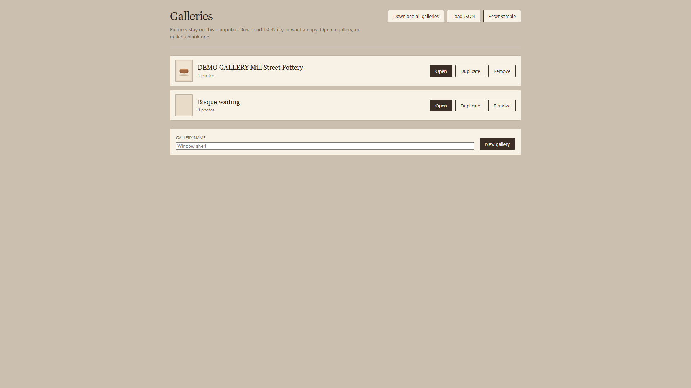
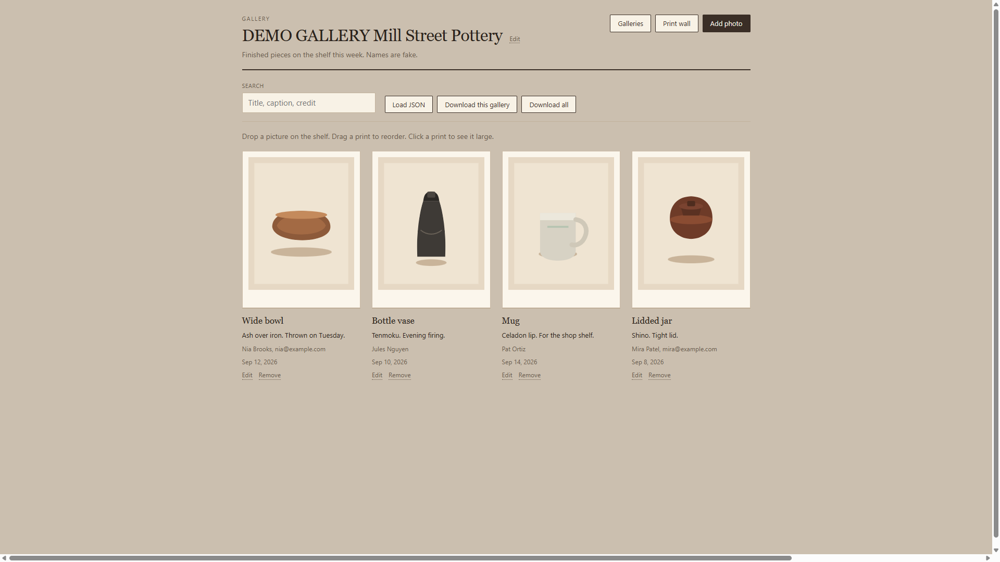
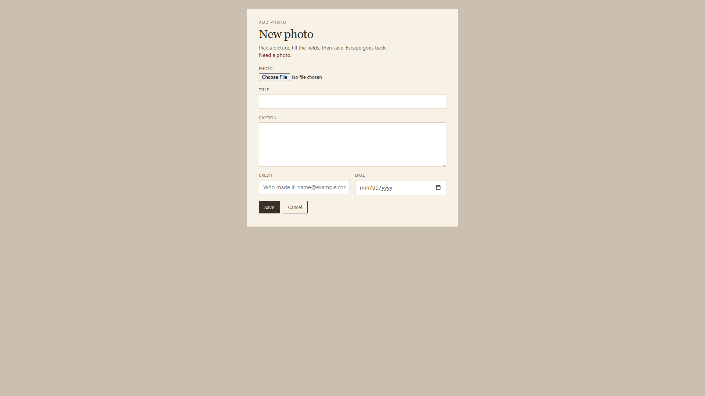

# Gallery

Photos with captions. Add a picture. Move it. Keep more than one
gallery. Load and download JSON. Drop `src/lib/` into a React app you
already have.

Try it:
https://aaronlb912.github.io/gallery/

Pictures on that page stay in your browser until you sign in. Get the
files if you want the gallery in your own app. To use the same
galleries on your laptop and phone, sign in on the Galleries page.

The demo starts on the gallery list. DEMO GALLERY Mill Street Pottery
is the sample. Names are fake. Open it, or make a blank gallery.

## Who it is for

A shop or studio that already runs React and needs a wall of pictures
on a page. Put your photos and captions in. Save the JSON.

## What you get

Copy `src/lib/`. That folder is the component.

- `Workspace.jsx` - gallery list plus the open gallery
- `Gallery.jsx` - one gallery
- `Item.jsx` - compact piece
- `ItemPage.jsx` - new photo and edit
- `View.jsx` - large print
- `gallery.css` - the look
- `gallery-json.js` - download, load parse, blank template, and move
  helpers
- `cloud-store.js` - optional sign-in save for the demo
- `sample-gallery.js` - Mill Street Pottery sample
- `index.js` - the import

No account to try the gallery. Sign in is optional if you want the same
galleries on another device. Galleries opens the list. A new gallery
starts empty.
Duplicate a gallery. You cannot remove the last one. The demo keeps
galleries after a refresh (Reset sample on the list if you want Mill
Street back). Add photo in the header opens a page. Escape cancels.
Drop a picture on the grid to add it. Drag a piece to reorder. Click a
print to see it large. Escape goes back. Remove a piece, then Undo for
a few seconds. Print wall sends the shelf to the printer. Search
finds title, caption, and credit. Rename the gallery with Edit. Edit a
piece for title, caption, credit, and date. Load JSON for one gallery
or all galleries. Download this gallery or all galleries. Old JSON with
only `caption` still loads.

## Run the demo

Live: https://aaronlb912.github.io/gallery/

Files: https://github.com/Aaronlb912/gallery

On your machine:

```
npm install
npm start
```

Open http://127.0.0.1:49340/

## Demo







https://github.com/user-attachments/assets/e2a4aace-49f0-4c48-a073-82e184b68766

Repo copy: [docs/media/gallery-demo.mp4](docs/media/gallery-demo.mp4)

Voice is Microsoft Andrew Neural. Music is Wallpaper by Kevin MacLeod (incompetech.com), CC BY 3.0.

## Private copy

The public page is a try. Galleries stay in that browser until you sign
in.

1. Open the Galleries page.
2. Click Sign in. A window opens.
3. Make a free account, or sign in if you already have one.
4. This page remembers you. Edits save to that account.
5. On another device, open the same demo and sign in with that same
   account.

You do not copy a key or an id. Sign out if this computer should stop
saving to the account.

## Copy into an app

Copy the `src/lib/` folder into your React `src/` folder.

```
import { Workspace } from './lib'
```

Or one gallery:

```
import { Gallery } from './lib'
```

## Props

`Workspace`

- `value` - `{ galleries, activeGalleryId }`
- `onChange(next)` - full workspace
- `onResetSample` - optional. Demo uses this for Reset sample.
- `cloud`, `cloudNote`, `cloudMiss`, `onSignInCloud`, `onPullCloud`,
  `onForgetCloud` - optional. The demo uses these for Sign in.
  A host app can omit them and save `value` itself.

`Gallery`

- `value` - one gallery `{ id, title, note, items }`
- `onChange(next)` - that gallery
- `onGalleries` - optional. Back to the list
- `onLoadWorkspace(next)` - optional. When a loaded file has many galleries
- `onDownloadAll` - optional

A piece is `{ id, src, title, caption, credit, date }`. `src` is a data
URL. Host apps save `value` however they want. The demo uses
localStorage. Do not treat that as the only save path.
